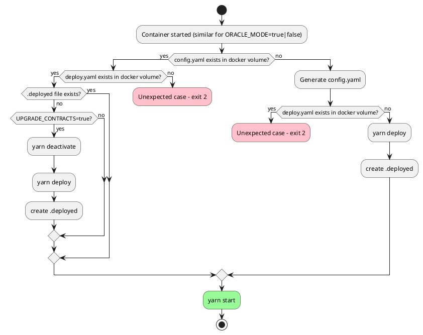

# Payment Server (CREDIT CARD/ACH)

Official BlockApps Credit Card and ACH Payment Server | Powered by Stripe

## PlantUML for docker-run.sh
Paste the following to planttext.com to see the sequence diagram of docker-run.sh logic


## Endpoints

##### GET `/ping`
Lets you play a full game of ping pong with Fan ZhenDong, one of the top table tennis players in the world.

---
### Redemption Endpoints

##### GET `/redemption/outgoing/:commonName`
**Returns** a list of outgoing redemption requests for a given `commonName`.

##### GET `/redemption/incoming/:commonName`
**Returns** a list of incoming redemption requests for a given `commonName`.

##### POST `/redemption/create`
Create a new redemption request.
```
{
  redemption_id: number,
  quantity: number,
  ownerComments: string,
  issuerComments: string,
  ownerCommonName: string,
  issuerCommonName: string,
  assetAddresses: string[],
  assetName: string,
  status: 1,
  shippingAddressId: number
}
```
**Returns** the `redemptionId` of the new request.

##### GET `/redemption/:id`
**Returns** the redemption request associated with the given `id`.

##### DELETE `/redemption/id/:id`
Delete a redemption request associated with the given `id`.
**Returns** the count of rows deleted.

##### PUT `/redemption/close/:id`
Close a redemption request associated with the given `id` and update the issuer comment field.
```
{
  issuerComments: string,
  status: 2 or 3
}
```
**Returns** the count of rows changed.

---
### Customer Endpoints

##### GET `/customer/address/:commonName`
**Returns** a list of addresses associated with the given `commonName`.

##### POST `/customer/address`
Add an address using the following information from the JSON body:
```
{
  commonName: string,
  name: string,
  zipcode: string,
  state: string,
  city: string,
  addressLine1: string,
  addressLine2: string optional,
  country: string
}
```
**Returns** the `id` of the newly added address in the table.

##### GET `/customer/address/id/:id`
Gets an address given the table `id` of the address. 
**Returns** the address in the `data` field of the response.

##### DELETE `/customer/address/id/:id`
Deletes an address given the table `id` of the address.  
**Returns** the number of `changes` made after the deletion.

---
### Stripe Endpoints

##### GET `/stripe/onboard?:username&:redirectUrl`
Onboard a user, `username` and `redirectUrl` required.  
**Returns** a redirect to the Stripe hosted connect link for the user.

##### GET `/stripe/status?:username`
Get the status of a stripe account given the `username` as a parameter.  
**Returns** the status of `chargesEnabled`, `detailsSubmitted`, and `payoutsEnabled` of the Stripe account.

##### GET `/stripe/checkout?:token&:redirectUrl`
Create and redirect to a Stripe hosted checkout session given the token of the order and a redirect back to the Marketplace.  
**Returns** a redirect to the Stripe checkout session for the provided order.

##### GET `/stripe/checkout/confirm?:token&:redirectUrl`
Confirms the payment of the order associated with the given token and performs the onchain transfer of the assets.  
**Returns** a redirect back to the Marketplace (redirectUrl) along with the list of assets that were transferred.

##### GET `/stripe/checkout/cancel?:token&:redirectUrl`
Cancels the order associated with the given token.  
**Returns** a redirect back to the Martkeplace (redirectUrl).

##### GET `/stripe/order/status?:tokens`
Get the most recent statuses of the orders associated with a given list of tokens.  
**Returns** a key/value pair of token to payment status.

## Dependencies

1. Docker Engine v24+ (For dockerized deployment)
2. Docker Compose V2
3. NodeJS 14+

*NOTE*  
Report and update dependencies if needed.

## Running

The server **requires** the following environmental variables to run in non-dockerized mode:
```
`STRIPE_SECRET_KEY` for Stripe API
`STRIPE_CONTRACT_ADDRESS` to the Stripe ExternalPaymentService contract
`METAMASK_CONTRACT_ADDRESS` to the MetaMask ExternalPaymentService contract

-- Optional --
`POSTGRES_SERVER_URL`
`POSTGRES_PORT`
`POSTGRES_USER`
`POSTGRES_PASSWORD`
`POSTGRES_DBNAME`

```

If running non-dockerized, use `npm run start` or `npm run dev`.  
If running dockerized, provide a `docker-compose.payment-server.yml` file and use `docker-compose -f docker-compose.payment-server.yml up -d --remove-orphans`.

## Script
To manually run the script below, first copy the necessary config files by running:
```
cp /config/config.yaml config.yaml
cp /config/deploy.yaml config/deploy.yaml
```

To offboard a seller, run the following command:
```
SELLER_NAME="sellerCommonName" yarn offboard
```

## Testing

The payment server uses `jest` as its testing framework. In order to run the tests, the following environment variables should be available:
```
<!-- REQUIRED ENV -->
`STRIPE_SECRET_KEY` for Stripe API
`STRIPE_CONTRACT_ADDRESS` to the Stripe ExternalPaymentService contract
`METAMASK_CONTRACT_ADDRESS` to the MetaMask ExternalPaymentService contract
`TEST_MODE` = 'true'

-- Optional --
`POSTGRES_SERVER_URL`
`POSTGRES_PORT`
`POSTGRES_USER`
`POSTGRES_PASSWORD`
`POSTGRES_DBNAME`
```

**It is highly recommended to use a separate database for testing purposes**. Afterwards, simply run `npm run test`.

